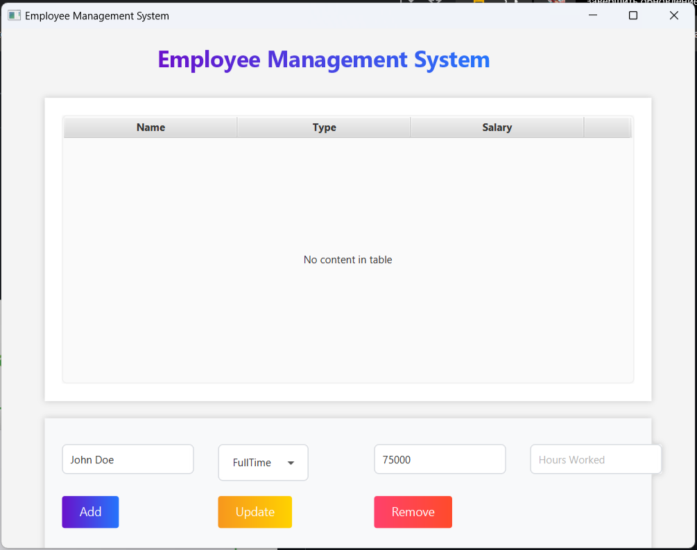

### README.md for Employee Management System

# Employee Management System

## Project Description
The **Employee Management System** is a JavaFX application that helps users manage employee details and calculate their salaries. The system is designed using OOP principles with an abstract `Employee` class and its subclasses: `FullTimeEmployee`, `PartTimeEmployee`, and `Contractor`. Users can:
- Add employees to the system.
- View a list of employees in a table.
- Calculate and update salaries dynamically.
- Remove employees from the table.

This project uses JavaFX's `TableView` for displaying data and provides a clean, user-friendly GUI built with SceneBuilder.

---

## Features
- Add employees with specific details: name, type (Full-Time, Part-Time, Contractor), hourly rates, hours worked, etc.
- Automatically calculate salaries based on the employee type and input details.
- Display employee data in a table format.
- Update and remove employees easily.
- Validation to ensure valid input (e.g., non-negative hours and positive rates).

---

## Instructions to Run the Program
1. Clone the repository from GitHub:
   ```bash
   git clone https://github.com/nurjamal505/Employee-Management-System.git
   ```
2. Open the project in IntelliJ IDEA or any preferred IDE.
3. Set up the JavaFX SDK and add it to the project.
4. Run the `HelloApplication.java` file to launch the application.

---

## How to Use the Application
1. Enter the employee’s **name** in the text field.
2. Select the **type** of employee from the dropdown:
   - **Full-Time:** Enter an annual salary in the "Enter Salary / Rate" field.
   - **Part-Time:** Enter an hourly rate in "Enter Salary / Rate" and hours worked in "Enter Hours Worked".
   - **Contractor:** Enter an hourly rate in "Enter Salary / Rate" and maximum hours in "Enter Hours Worked".
3. Click **Add Employee** to add the employee to the table.
4. Click **Update Salaries** to recalculate and display updated salaries in the table.
5. Select an employee in the table and click **Remove Employee** to delete them.

---

## Screenshots

### Initial Screen
- **Inputs:**
  - Name: "John Doe"
  - Type: "Full-Time"
  - Salary: "75000"
  - Hours Worked: *(Leave empty for Full-Time)*



---

### Adding a Part-Time Employee
- **Inputs:**
  - Name: "Anna Brown"
  - Type: "Part-Time"
  - Salary: "25" (Hourly Rate)
  - Hours Worked: "30"


---

### Adding a Contractor
- **Inputs:**
  - Name: "Michael Lee"
  - Type: "Contractor"
  - Salary: "50" (Hourly Rate)
  - Hours Worked: "160" (Maximum Hours)
  

---

### Final Table
After adding all employees, the table will look like this:


---

## Validation Examples
- If any field is left empty or contains invalid input (e.g., negative hours or salary), an error alert will appear:
  - **Error Message Example:** "Please enter valid data. Fields cannot be empty or negative."

---

### Additional Notes
- Developed using JavaFX with SceneBuilder.
- Follows MVC design principles.
- Designed for intuitive usage with a clean GUI.

Let me know if you need help with GitHub setup or detailed screenshots!
